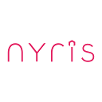

nyris SDK for Android
=======


Introduction
------
nyris is a high performance visual product search, object detection and visual recommendations engine 
for retail and industry. 

For more information please see [nyris.io](https://nyris.io/)

We provide a new SDK with better error handling and reactive programming support.
The SDK is written in [Kotlin](https://kotlinlang.org/) and compatible with [Java](https://docs.oracle.com/javase/8/docs/technotes/guides/language/index.html). 

Why new SDK ?
-----
The the old [SDK](https://github.com/nyris/Nyris.IMX.Android) is offering only image matching services 
and based on asynchronous callback system. This new SDK offers :

* Support of Reactive programming paradigm
* No more asynchronous callback/asyncTask
* Better multithreading handling
* Better error handling
* Type-safe HTTP client
* Unified response
* All the different nyris services 

nyris services 
-----
We offer : 
* Visual search
* Similarity search by image
* Object detection
* Manual matching
* Text Search
* Similarity search by SKU

Requirements
----- 
* Android >= 4.0
* Images in **JPEG** format
* The minimum dimensions of the image are `512x512 px`
* The maximum size of the image is less than or equal to `500 KB` 

Installation
-----
### Java Gradle
For easy package usage repository add [JitPack](https://jitpack.io/) in your root build.gradle:
```groovy
allprojects {
    repositories {
        ...
        maven { url 'https://jitpack.io' }
    }
}
```

Add the dependencies
```groovy
dependencies {
    implementation 'com.github.nyris:sdk.android:1.x.x'
    implementation "android.arch.lifecycle:extensions:1.x.x" //Optional
}
```

Get Started
-----
### Jump To

* [Get instance](#get-instance)
* [Destroy the instance](#destroy-the-instance)
* [Match your first image](#match-your-first-image)
* [Extract objects from your image](#extract-objects-from-your-image)
* [Text Match Search](#text-match-search)
* [Dex Count Methods Info](#dex-count-methods-info)

### Get instance 
First, initialize an instance of `INyris` with your API Key :
 
`java`
```java
class Sample{
    private INyris nyris;
    public Sample(){
        nyris = Nyris.Companion.getInstance("YOUR_API_KEY");
        //OR
        nyris = Nyris.Companion.getInstance("YOUR_API_KEY", /*Enable debug outputs*/true);
    }
}
```

`kotlin`
```kotlin
class Sample{
    private var nyris : INyris
    init{
        nyris = Nyris.getInstance("YOUR_API_KEY")
        //OR
        nyris = Nyris.getInstance("YOUR_API_KEY", /*Enable debug outputs*/true)
    }
}
```
### Destroy the instance 
You can easily free the created instance by adding the instance to the lifecyle of your main activity
or by calling `destroy()` of the sdk

`kotlin`
```kotlin
class MainActivity : AppCompatActivity() {
    override fun onCreate(savedInstanceState: Bundle?) {
        super.onCreate(savedInstanceState)
        setContentView(R.layout.activity_sample)
        lifecycle.addObserver(nyris)
    }
    
    //OR
    override fun onDestroy(){
        super.onDestroy()
        nyris.destroy()    
    }
}
```

**NOTE** : to make the SDK fully compatible with lifecycle-aware components you will need to add the missing dependecy 
```groovy
dependencies {    
    implementation "android.arch.lifecycle:extensions:1.x.x"
}
```

### Match your first image 
#### Basic way to match an image : 

`java`
```java
    byte[] imageByteArray = /*Your byte array*/;
    nyris
        .imageMatching()
        .match(imageByteArray)
        .subscribe(offerResponseBody -> {   
            //Handle your response
            List<Offer> offers = offerResponseBody.offers
        }, throwable -> {
            if(throwable instanceof HttpException){
                ...
            }else if(throwable instanceof IOException){
                ...
            }else {
                //Unknown                
            }
        });
```

`kotlin`
```kotlin
    val imageByteArray : ByteArray = /*Your byte array*/
    nyris
        .imageMatching()
        .match(imageByteArray)
        .subscribe({/*it:OfferResponseBody*/        
            //Handle your response
            val offers = it.offers
            
        },{/*it:Throwable*/            
            when (it) {
                is HttpException -> {
                    ...
                }
                is IOException -> {
                    ...
                }
                else -> {
                    //Unknown
                }
            }
        })
```

#### Advanced way to match an image : 

`kotlin`
```kotlin
    val imageByteArray : ByteArray = /*Your byte array*/
    nyris
        .imageMatching()
        .outputFormat("PROVIDED_OUTPUT_FORMAT") // Set the desired OUTPUT_FORMAT
        .language("de") //Return only offer with language "de"
        .exact(true) //Performs exact matching
        .similarity(true) //Performs similarity matching
        .similarityThreshold(0.5f) //The lower limit of confidences to be considered good from similarity
        .similarityLimit(10) //The upper limit for the number of results to be returned from similarity
        .ocr(true) //Performs optical character recognition on the images
        .regroup(true) //This mode enables regrouping of the items
        .regroupThreshold(0.5f) //The lower limit of confidences for the regroup
        .limit(10) //Limit returned offers
        .match(imageTestBytes)
        .subscribe({/*it:OfferResponseBody*/        
            //Handle your response
            val offers = it.offers
            
        },{/*it:Throwable*/            
            ...
        })
```
The response is an object of type `OfferResponseBody` that contains list of `offers`. 

* If you have your provided output format, you should use this call to get response as `JSON` format :

`kotlin`
```kotlin
    val imageByteArray : ByteArray = /*Your byte array*/
    nyris
        .imageMatching()
        .match<JsonResponseBody>(imageByteArray, JsonResponseBody::class.java)
        .subscribe({/*it:JsonResponseBody*/
        
            //Handle your response
            val json = it.json
        },{/*it:Throwable*/            
            ...
        })
```

### Extract objects from your image 
Extract objects from an image

`kotlin`
```kotlin
    nyris
        .objectProposal()
        .extractObjects(imageByteArray)
        .subscribe({/*it:List<ObjectProposal>*/
            //Handle your response
            val objects = it
        },{/*it:Throwable*/   
            ...
        })
```
Returned response is a List of ObjectProposal. 

The extracted object has :
* `confidence` is the probability of the top item. Value range between : `0-1`.
* `region` is a Bounding box. It represents the location and  thesize of the object in the sent image. 


### Mark sent image for manual matching : 
It happened that our service can't recognize or match an image, this is why we provide you a service to notify us
about the unrecognized image and we will match it manually.

Before you mark an image for manual match you will need to extract the `requestId`. 

`kotlin`
```kotlin   
    nyris
        .imageMatching()
        .match<OfferResponse>(imageByteArray, OfferResponse::class.java)
        .subscribe({/*it:OfferResponse*/        
            //Handle your response
            requestId = it.headers!!["X-Matching-Request"]
            
        },{/*it:Throwable*/    
            ...
        })
```

After getting the `requestId` you can mark the image for manual matching. 

`kotlin`
```kotlin
    nyris
        .manualMatching()
        .markForManualMatch(requestId)
        .subscribe({/*it:ResponseBody*/    
            ...
        },{/*it:Throwable*/    
            ...
        })
```

### Text Match Search
nyris offers a service that helps you to search offers by text, sku, barcode, ...etc

you can use the text search service the same way like old [image matching service]()

#### Basic way to search : 

`kotlin`
```kotlin
    nyris
        .textSearch()
        .searchOffers("YOUR_TEXT")
        .subscribe({/*it:OfferResponseBody*/        
            //Handle your response
            val offers = it.offers
            
        },{/*it:Throwable*/ 
            ...
        })
```

#### Advanced way to search : 

`kotlin`
```kotlin
    nyris
        .textSearch()
        .outputFormat("PROVIDED_OUTPUT_FORMAT") // Set the desired OUTPUT_FORMAT
        .language("de") //Return only offer with language "de"
        .regroup(true) //This mode enables regrouping of the items
        .regroupThreshold(0.5f) //The lower limit of confidences for the regroup
        .limit(10) //Limit returned offers
        .searchOffers<JsonResponseBody>("YOUR_TEXT", JsonResponseBody::class.java)
        .subscribe({/*it:JsonResponseBody*/        
            //Handle your response
            val json = it.json
            
        },{/*it:Throwable*/ 
            ...
        })
```

### Dex Count Methods Info
The dex count for the SDK is around 580 methods which mean around 1% of 64k methods Limit.  

    Total methods in library: 580 (0.89% used)
    Total fields in library:  245 (0.37% used)
    Total classes in library:  123 (0.19% used)

License
=======
    Copyright 2018 nyris GmbH
    
    Licensed under the Apache License, Version 2.0 (the "License");
    you may not use this file except in compliance with the License.
    You may obtain a copy of the License at
    
       http://www.apache.org/licenses/LICENSE-2.0
    
    Unless required by applicable law or agreed to in writing, software
    distributed under the License is distributed on an "AS IS" BASIS,
    WITHOUT WARRANTIES OR CONDITIONS OF ANY KIND, either express or implied.
    See the License for the specific language governing permissions and
    limitations under the License.